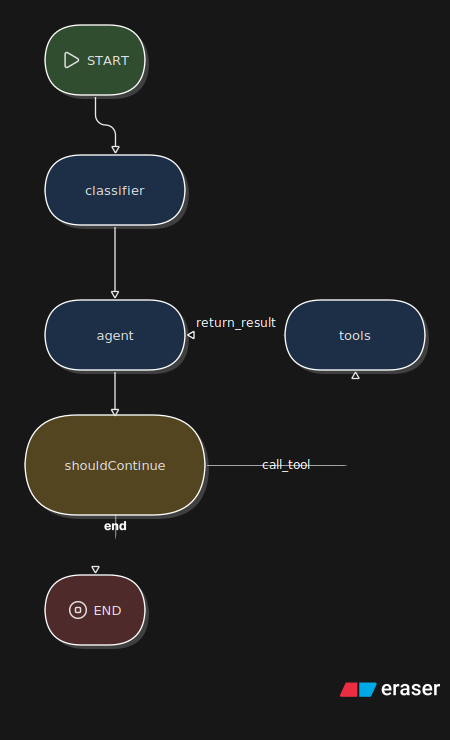

# AstroAgent ✨

AstroAgent is an AI-powered astrology companion that calculates mathematically accurate astrological birth charts and delivers personalized, deeply mystical insights. Built with a modern React frontend and a LangGraph-powered Node.js backend, AstroAgent acts as a spiritual guide, providing daily horoscopes, chart analyses, and empathetic astrological guidance.

## Key Features

- **Accurate Ephemeris Calculations:** Uses `astronomy-engine` for highly precise planetary positioning and chart calculations.
- **Advanced Agentic Routing:** Leverages **LangGraph** to classify intents and route user queries intelligently.
- **Gemini-Powered Insights:** Uses `gemini-3.1-flash-lite` via LangChain for empathetic, in-character astrological readings.
- **Real-Time Streaming:** Backend streams responses to the React client via Server-Sent Events (SSE) for a seamless UX.
- **Conversational Memory:** Persists chat sessions and LLM conversational state securely in a Supabase PostgreSQL database.

---

## 🏗️ Architecture Overview

AstroAgent employs a modern, decoupled architecture designed for fluid streaming and agentic reasoning:

### 1. Frontend (React / Vite)
- The client manages the Chat UI, Markdown rendering, and sidebar session history.
- It consumes **Server-Sent Events (SSE)** to stream the LLM response in real-time, masking complex intermediate JSON tool calls from the user for absolute UI stability.

### 2. Backend (Node.js / Express)
- Serves as the secure bridge between the client and the LangGraph agent.
- Provides RESTful endpoints (e.g., `/api/chat`) and instantly streams events back to the client as the agent thinks and responds.

### 3. AI Agent Layer (LangGraph & LangChain)
- **Intent Classifier Node:** Intercepts incoming messages to determine the user's goal (e.g., horoscope, chart calculation, or general query).
- **Core Agent Node:** Powered by `gemini-3.1-flash-lite`, it formulates empathetic, in-character astrological responses.
- **Conditional Routing Node:** Analyzes the LLM's output to determine whether it needs to route the flow to external tools or return a final response to the user.
- **Tool Node:** Executes deterministic functions on behalf of the agent. The 4 tools used are:
  - `compute_birth_chart`: Calculates precise planetary degrees for the user's natal chart using `astronomy-engine`.
  - `get_daily_transits`: Computes real-time planetary positions to provide accurate daily horoscopes.
  - `geocode_place`: Converts location strings (cities, birthplaces) into exact latitude and longitude coordinates.
  - `knowledge_lookup`: Searches a semantic database to retrieve domain-specific astrological interpretations and lore.

### 4. Database (Supabase)
- **State Management:** Stores user birth profiles, chat session metadata, and acts as the long-term memory for LangGraph via the `langgraph_checkpoints` table.

---

## Diagram of LangGraph graph



## 🛠️ Prerequisites

- **Node.js** v18+
- **Supabase** account and project
- **Google Gemini API Key**

---

## 📦 Database Setup (Supabase)

Before running the application, you must configure your Supabase database. You will need three primary tables:

1. **`user_profiles`**
   - Stores the user's birth details (Name, DOB, Time, Location, Lat, Lon, Timezone).
2. **`chat_sessions`**
   - Stores metadata for each conversation (id, user_id, title).
3. **`langgraph_checkpoints`**
   - Stores the persistent conversational state from LangGraph.
   - **Important**: Must include a `thread_id` (PK, string), `message_history` (JSON), and `checkpoint_data` (JSON/binary).

---

## ⚙️ Environment Variables

### 1. Server (`server/.env`)
Create a `.env` file in the `/server` directory and add the following keys:

```env
# Supabase Configuration
SUPABASE_URL=your_supabase_project_url
SUPABASE_ANON_KEY=your_supabase_anon_key
SUPABASE_SERVICE_ROLE_KEY=your_supabase_service_role_key

# Google Gemini / AI Provider
GOOGLE_API_KEY=your_google_gemini_api_key

# Server Config
PORT=4000
ALLOWED_ORIGIN=http://localhost:5173  # Change to 5174/5175 if Vite uses a different port
```

### 2. Client (`client/.env`)
Create a `.env` file in the `/client` directory and add the following keys:

```env
# Supabase Configuration
VITE_SUPABASE_URL=your_supabase_project_url
VITE_SUPABASE_ANON_KEY=your_supabase_anon_key

# Backend API URL
VITE_LANGGRAPH_API_URL=http://localhost:4000/api/chat #PORT number must be same as in server
```

---

## 🚀 Installation & Running

### Start the Backend Server
```bash
cd server
npm install
npm run dev
```
The server will start using `nodemon` on `http://localhost:4000`.

### Start the Frontend Client
Open a new terminal window:
```bash
cd client
npm install
npm run dev
```
The client will start using `vite`, typically on `http://localhost:5173`.

---

## Engineering Tradeoffs (IMPORTANT !!!)
* **Ephemeris Data:** The original brief requested House calculations. Initially, I attempted to use the `swisseph` Node wrapper to accomplish this. However, it relies on C++ binaries that caused node-gyp build failures in my local Windows environment. To unblock development and meet the deadline, I pivoted to `astronomy-engine` (a pure JS library). This fulfills the core requirement of non-hallucinated, mathematically accurate planetary ephemeris data, though I consciously scoped out House calculations as they require complex spherical trigonometry not native to the engine.

* **Authentication:** I completely bypassed a true user authentication flow.
    - I dropped the user_profiles_id_fkey constraint that linked your profiles to Supabase's internal auth.users table.
    
    - To make the frontend work, I eventually settled on a useEffect hook that simply grabs the very first profile it finds in the database (LIMIT 1).
The "Why": Building a secure login/signup screen, handling JWT tokens, and managing session cookies takes hours. For a take-home assignment focused on AI integration, auth is a distraction. So for now I traded production-level security for the ability to instantly test the chat interface.

* **UI Stability vs. Perfect Stream Parsing:** I implemented "brute force" UI fallbacks instead of a complex stream buffer parser.
    - When the backend leaked the `{"intent": "chart_request"}` JSON into the stream, I used string-slicing directly inside the React render cycle to hide it.
    - When incomplete Markdown tokens (like `bol...`) crashed the app, I wrapped `<ReactMarkdown>` in an Error Boundary that temporarily flashes raw text.
The "Why": Handling Server-Sent Events (SSE) perfectly requires buffering chunks, checking for complete JSON, and parsing markdown on the fly. That is incredibly complex. I traded data cleanliness at the network layer for absolute UI stability, ensuring the user never sees a "White Screen of Death."

* **Local Variables vs. Strict React Reactivity:** I bypassed React state for the initial network request.
    - When creating a new chat session, I stored the newly generated Supabase ID in a local variable (`let currentSessionId = activeSessionId`) and fed that directly to the fetch body, rather than waiting for `setActiveSessionId` to trigger a re-render.
The "Why": React state is asynchronous. Waiting for the state to update was causing a race condition where the first message sent a null session ID to the backend. Using a local variable was the fastest way to guarantee the backend received the correct ID immediately without rewriting the entire component lifecycle.

* **Direct Database Fetches vs. State Management Tools:** I injected Supabase database calls directly into Express route handlers and React component functions.
    - When the AI asked for birth details that had already been provided, I added a quick Supabase query right in the middle of the `/api/chat` Express route to fetch the profile and inject it into the LangGraph system prompt.
The "Why": In a massive production app, I would likely use a state manager (like Redux or Zustand) or an ORM (like Prisma) to handle user context. For this build, direct SQL/Supabase client calls were the most pragmatic way to bridge the context gap between the frontend and the AI.

* **Chat Session Titles:** Automatically generates a title using the first ~30 characters of the user's first message.
